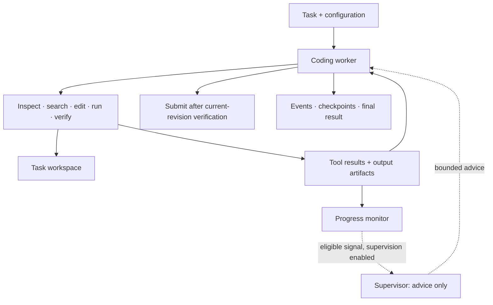

# Adaptive Coding Agent

[](https://github.com/adhithyasash1/coding-agent/actions/workflows/checks.yml)


**A coding agent that edits, verifies, and leaves an inspectable record of its work.**

A Python harness for running coding tasks through an OpenAI-compatible model endpoint. One worker owns the workspace; an optional supervisor offers bounded, evidence-based recovery advice when progress stalls. Tools, model usage, verification, and failures are recorded throughout the run.

[Try the demo](#try-it-without-an-api-key) · [Run a task](#run-a-real-task) · [Architecture](docs/architecture.md) · [Evaluation results](docs/EVALUATION_REPORT.md)

## What makes it useful

- **Verification before completion.** Submission requires a successful check of the current workspace revision. Later file or permission changes invalidate that receipt.
- **One worker, bounded supervision.** The supervisor can advise but cannot execute tools or edit files. Its calls share the worker's time and token budget.
- **Inspectable execution.** Ordered JSONL events, full tool-output artifacts, diagnostic checkpoints, and final results make successes and failures reviewable.
- **Explicit execution boundaries.** Docker runs tools with network access disabled by default. A local backend supports trusted fixtures and evaluator-provided sandboxes.
- **Budget-aware operation.** Turn, token, and wall-clock limits bound a run; deadline failures and incomplete usage accounting remain visible.
- **Evaluation integrations.** Harbor and Pier adapters support development workflows for Terminal-Bench, SWE-bench, and DeepSWE, including patch export and collection.

The core package has one runtime dependency: `httpx`. Inference providers and evaluation SDKs are separate integrations.

## Try it without an API key

Requires **Python 3.11+** and **[uv](https://docs.astral.sh/uv/)**.

```sh
git clone https://github.com/adhithyasash1/coding-agent.git
cd coding-agent
uv sync --locked --group dev
uv run python scripts/demo.py
```

The demo creates a small invoice project, reproduces a failing test, changes `price + count` to `price * count`, verifies the fix, and submits the result. It runs locally with deterministic scripted model responses, so it needs neither Docker nor a paid API.

The final JSON reports `"status": "submitted"`. The demo also prints an inspection command for its trace under `.agent-runs/demo-*/trace`.

This demonstrates the complete execution workflow; the repair decisions are scripted rather than generated by a live model.

## How it works



The worker maintains task context and persistent notes across bounded context trimming. Tools support exact atomic edits, managed processes, argument-vector verification, and retrieval of captured output artifacts. A deterministic monitor detects repeated actions with unchanged results and workspace state; the worker can also request help explicitly.

Set `supervision` in the configuration's `[run]` section:

| Mode | Behavior |
| --- | --- |
| `off` | Worker only; observations remain traceable |
| `shadow` | Default: record stuck signals without calling an advisor |
| `on` | Request supervisor advice on eligible signals |

Advice must cite supplied event IDs and propose a concrete next action with expected progress. Invalid advice is logged and ignored. A cooldown and intervention cap limit supervisor calls; the default cap is three.

## Run a real task

Start Docker, copy the example configuration, and set `name`, `base_url`, and model revision metadata for your endpoint. The model must support the harness's tool-calling workflow.

```sh
cp agent.example.toml agent.local.toml
# Edit agent.local.toml for your model and endpoint.
export AGENT_API_KEY="$(python3 -c 'import getpass; print(getpass.getpass("Endpoint key: "))')"

uv run coding-agent run \
  --config agent.local.toml \
  --task-file /absolute/path/to/task.txt \
  --workspace /absolute/path/to/task-checkout \
  --trace-dir /absolute/path/to/new-run-directory
```

Use a separate task checkout. The trace directory must be outside that workspace. Local configuration, environment files, and run artifacts are excluded from version control.

The default Docker backend uses `python:3.12-slim`, two CPUs, 4 GiB RAM, no network, and a persistent workspace. Supply `--image` with an image containing your task's dependencies; use `--network bridge` if the task needs network access. Pin images by digest for measured evaluations. The default image is only a minimal Python environment.

`--backend local` executes commands directly on the host. Use it for trusted tasks or within a sandbox supplied by an evaluator. File-path containment does not sandbox shell commands. Interactive processes support pipe stdin; real PTYs are not yet supported.

### Inspect the result

```sh
uv run coding-agent inspect /absolute/path/to/new-run-directory
uv run coding-agent inspect /absolute/path/to/new-run-directory --events
```

Progress is written to stderr; the final JSON is written to stdout. A successful worker submission records its own verification, while an external grader determines benchmark correctness. See [trace semantics](docs/tracing.md) for redaction, failure recovery, and checkpoint limitations.

## Evaluation status

This is a working research and engineering harness with local end-to-end coverage and live development trials. The recorded frozen four-task Terminal-Bench 2.1 sample produced **two first-pass grader passes, one grader failure, and one infrastructure interruption**. Later retries and SWE-bench smokes are labeled separately in the [evaluation report](docs/EVALUATION_REPORT.md).

These small development samples are not leaderboard scores or a general solve-rate estimate. There is no paired evaluation demonstrating a supervisor benefit. The latest reliability improvements and experimental policies have local validation, but have not established a benchmark improvement. Docker CLI transport has local test coverage; full container execution was not validated on the original development machine.

Independent [experiment profiles](profiles/README.md) isolate reasoning effort, time-aware generation, context layout, and progress interventions. New policies remain opt-in pending matched live validation. The [local experiment example](examples/README.md) rehearses process control and admission checks without launching cloud compute.

## Development

```sh
uv sync --locked --group dev
uv run pytest
uv run ruff check .
uv run ruff format --check .
uv run mypy
uv run python scripts/check_complexity.py
uv build
```

Core tests use scripted responses and local servers without paid model calls. CI checks Python 3.11, 3.12, and 3.14, and runs a separate pinned Harbor/Modal SDK contract job. Optional integration setup is documented in [evaluations](docs/evaluations.md).

## Explore the project

| Path | Contents |
| --- | --- |
| [`src/coding_agent/`](src/coding_agent/) | Worker loop, model client, tools, budgets, supervision, and traces |
| [`integrations/`](integrations/) | Harbor/Pier adapters, Modal inference, and optional LangSmith export |
| [`tests/`](tests/) | Unit, integration, and end-to-end workflow tests |
| [`scripts/`](scripts/) | Offline demo, experiment runner, progress replay, and patch export |
| [`profiles/`](profiles/) | Isolated experimental configurations |
| [`docs/architecture.md`](docs/architecture.md) | Design decisions, experiment methodology, and deferred features |
| [`docs/local-reliability.md`](docs/local-reliability.md) | Environment discovery, verification receipts, and failure handling |
| [`docs/EVALUATION_REPORT.md`](docs/EVALUATION_REPORT.md) | Development results, limitations, and evidence index |
| [`docs/modal.md`](docs/modal.md) | Optional self-hosted inference setup |

Safe automatic resume, real PTYs, candidate branching, and persistent cross-task memory remain outside the current implementation. Raw benchmark artifacts, model weights, and credentials are not included.
